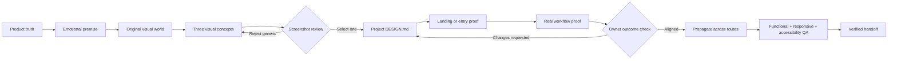

# Art Direction First

### A practical design workflow for building frontends that feel like products—not templates.

[](LICENSE)
[](docs/CROSS_AGENT_ADAPTER.md)
[](SKILL.md)

Art Direction First is an open-source workflow for creating original, premium websites, dashboards, and product interfaces with **Antigravity, Claude Code, Gemini, Kiro, Cursor, Windsurf, OpenAI coding agents, or any other agentic AI**.

It keeps the process reusable while allowing every project to choose its own product story, references, UI direction, visual world, typography, assets, icons, and motion language.

---

## The idea in one picture



> **The fastest way to a better frontend is to catch the wrong visual direction before building the entire product.**

## Start in three steps

### 1. Give the agent the workflow

Give the agent [`SKILL.md`](SKILL.md) and [`templates/agent-handoff.template.md`](templates/agent-handoff.template.md).

The workflow is tool-agnostic. If the agent does not have browser access, image generation, repository access, or backend access, it must use an equivalent method and report the limitation instead of silently skipping a stage. See [`docs/CROSS_AGENT_ADAPTER.md`](docs/CROSS_AGENT_ADAPTER.md).

### 2. Add the project’s inputs

Copy [`templates/project-brief.template.md`](templates/project-brief.template.md) and [`templates/asset-and-icon-brief.template.md`](templates/asset-and-icon-brief.template.md). Fill them in with plain language:

- What are you building?
- Who is it for?
- What problem does it solve?
- What is the core user workflow?
- What should it feel like?
- What should it never feel like?
- Which references should inspire it?
- Which fonts, icons, assets, and UI direction do you prefer?
- What existing behavior must remain functional?

You do not need to know design vocabulary. The agent can recommend a UI direction when you are unsure.

### 3. Run the gates in order

| Gate | What must be true before moving on |
|---|---|
| **Understand** | Product truth, users, workflow, constraints, and quality bar are clear |
| **Define** | Emotional premise, visual world, voice, metaphor, materials, and anti-patterns exist |
| **Explore** | Three materially different concepts are shown at desktop and mobile sizes |
| **Choose** | One concept is selected using the [scorecard](docs/VISUAL_CONCEPT_SCORECARD.md) |
| **Prove** | The landing/entry surface and one real workflow feel like the same product |
| **Propagate** | The project-specific [`DESIGN.md`](templates/design-system.template.md) is locked |
| **Verify** | Functional, responsive, accessibility, screenshot, and owner-outcome checks are evidenced |

Do not build every route before the **Prove** gate.

---

## What this prevents

AI agents are excellent at producing familiar UI quickly. Familiar UI is not the same as product identity.

This workflow is designed to prevent:

- Generic SaaS dashboards.
- Repeated rounded cards and pills.
- Random gradients and glass panels.
- Decorative terminal or AI language.
- Unrelated 3D objects and stock imagery.
- A landing page disconnected from the real product.
- A font or color change being mistaken for art direction.
- Technical terminology arriving before the human product story.
- Unverified claims about performance, persistence, or completion.

## The quality bar

A successful project has:

| Requirement | Evidence |
|---|---|
| Product diagnosis | A short explanation of the user, problem, workflow, and constraints |
| Product truth | Real behavior and truthful content are distinguished from fixtures or placeholders |
| Reference analysis | Each reference has a principle to study and a boundary not to copy |
| Emotional premise | The intended feeling is explicit |
| Original visual world | A named, ownable identity exists before full implementation |
| UI direction | The chosen interface language is justified by the product |
| Three concepts | Distinct compositions, not three color variations |
| Two-surface proof | Entry surface plus one complete real workflow |
| Screenshot review | Desktop and mobile screenshots are compared before propagation |
| Full propagation | Remaining routes share one system but express their different jobs |
| Functional QA | Happy paths, failure paths, direct routes, and persistence are tested |
| Responsive QA | Desktop, tablet, 375px, and 320px behavior is checked |
| Accessibility QA | Focus, labels, contrast, zoom, touch, and reduced motion are checked |
| Honest status | Verified, conditional, unverified, and rejected items are separated |
| Owner alignment | The owner or designated reviewer confirms the intended UI/UX was actually achieved |

Use [`references/qa-checklist.md`](references/qa-checklist.md) and [`docs/DESIRED_OUTCOME_VERIFICATION.md`](docs/DESIRED_OUTCOME_VERIFICATION.md) for the final review.

## How to hand it to any AI agent

Give the agent this repository and say:

> Use this repository as the governing art-direction workflow for the project. Read `SKILL.md` and `templates/agent-handoff.template.md` first. Follow the gates in order. Use the project brief as the source of truth. Analyze references as principles, not templates. Create three materially different visual concepts and show desktop/mobile proof before full implementation. Reject generic output. Lock the selected direction in `DESIGN.md`. Prove it on one landing or entry surface and one real workflow. Then propagate it and return screenshots, verified checks, unverified checks, limitations, and the preview URL. Do not call a font/color swap art direction, do not copy references, and do not claim completion without owner or reviewer alignment.

For a written review report, also state whether it is diagnostic, visual, functional, or acceptance evidence; which findings are binding; what may change; what must remain functional; and what screenshots are required. The detailed method is in the README’s [report handoff section](#passing-a-review-report).

## Hackathon mode

Use [`docs/HACKATHON_QUICKSTART.md`](docs/HACKATHON_QUICKSTART.md) when the sprint is time-boxed.

```text
15 min   Product truth + constraints
20 min   Visual direction + concept decision
60–90    Landing/entry surface + real workflow
90–180   High-value route propagation
30–45    Screenshots + functional/responsive/accessibility QA
```

Time-box the gates; do not remove them. If time runs out, ship the two-surface proof and label the rest unverified.

## Passing a review report

Give the AI agent:

1. The report file.
2. The project brief.
3. [`SKILL.md`](SKILL.md).
4. [`templates/agent-handoff.template.md`](templates/agent-handoff.template.md).
5. The expected scope of change.

Use this instruction:

> Read this report before editing. Classify its findings as required, recommended, or informational. Summarize the binding findings first. Preserve existing product behavior and data contracts. Apply the required changes to the entry surface and one real workflow first. Show desktop and mobile screenshots before propagating. Return verified and unverified checks separately.

## Repository map

| Path | Purpose |
|---|---|
| [`SKILL.md`](SKILL.md) | Core workflow and mandatory quality gates |
| [`templates/agent-handoff.template.md`](templates/agent-handoff.template.md) | Universal handoff for any agentic AI |
| [`templates/project-brief.template.md`](templates/project-brief.template.md) | Project truth, users, workflow, and constraints |
| [`templates/asset-and-icon-brief.template.md`](templates/asset-and-icon-brief.template.md) | Assets, fonts, icons, imagery, and motion |
| [`templates/design-system.template.md`](templates/design-system.template.md) | Project-specific `DESIGN.md` scaffold |
| [`references/reference-analysis.md`](references/reference-analysis.md) | Reference research without copying |
| [`references/ui-library-integration.md`](references/ui-library-integration.md) | Safe use of component and animation libraries |
| [`references/qa-checklist.md`](references/qa-checklist.md) | Visual, functional, responsive, and accessibility QA |
| [`docs/CROSS_AGENT_ADAPTER.md`](docs/CROSS_AGENT_ADAPTER.md) | Equivalent methods when an agent lacks a tool |
| [`docs/VISUAL_CONCEPT_SCORECARD.md`](docs/VISUAL_CONCEPT_SCORECARD.md) | Evidence-based concept comparison |
| [`docs/DESIRED_OUTCOME_VERIFICATION.md`](docs/DESIRED_OUTCOME_VERIFICATION.md) | Owner/reviewer confirmation gate |
| [`docs/HACKATHON_QUICKSTART.md`](docs/HACKATHON_QUICKSTART.md) | Rapid 4–8 hour execution plan |
| [`docs/HACKATHON_PRESENTATION_SCRIPT.md`](docs/HACKATHON_PRESENTATION_SCRIPT.md) | Script for teammates, mentors, or judges |
| [`CONTRIBUTING.md`](CONTRIBUTING.md) | Contribution guidelines |
| [`NOTICE.md`](NOTICE.md) | Scope and third-party reference notice |
| [`LICENSE`](LICENSE) | MIT License |

## Why this exists

This project began with a recurring problem: a working product could lose momentum when an AI-generated frontend looked generic, disconnected, or unlike what the owner imagined.

Art Direction First turns that personal solution into a reusable open-source method. It moves difficult decisions earlier, tests them sooner, reduces redesign stress, and gives people a dependable way to work with different AI agents without losing the product’s identity.

## Contributing and license

Read [`CONTRIBUTING.md`](CONTRIBUTING.md) before opening a pull request. The project is released under the [`MIT License`](LICENSE). This license covers the original workflow, documentation, and templates in this repository. External websites, assets, fonts, icons, and UI libraries mentioned here retain their own terms.
